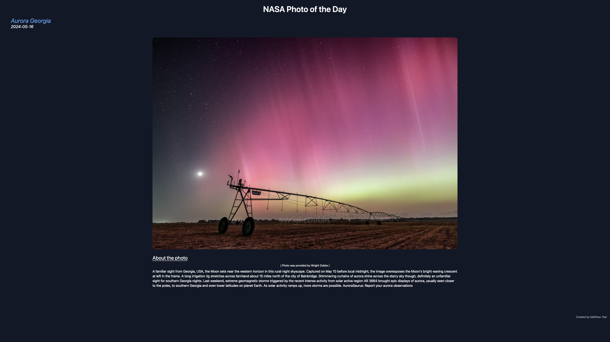

# Simple Website w/ NASA API

### Learning Golang and some other tools
I have decided to try out Go and have enjoyed it quite a bit. I am not a web developer at any means, but this type of work keeps me creative and learning backend more and more.

### About this project
This project is a simple website that allows you to view NASA's photo of the day. It also gives you a description about it as well.
The website/server was built with Go, HTML, and TailwindCSS.

### How to view the website
- Install Go
- Clone this repository
- Go to the directory you cloned it into
- In the terminal type:
```Bash
go run .
```


